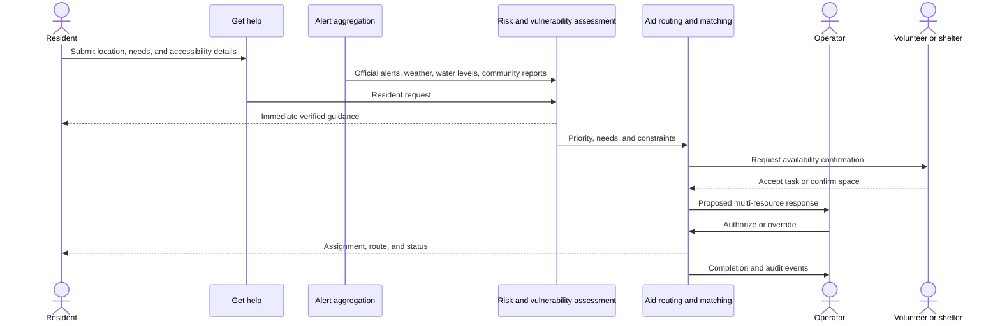

# AEGIS Response Network

## Product point of view

AEGIS is one response network with three focused entry points:

1. **Get help** — for a flood-affected resident.
2. **Offer support** — for a volunteer or shelter provider.
3. **Coordinate response** — for an authorized municipal or NGO operator.

These are role-specific views over the same incident, request, resource, match,
and decision records. They should not be merged into one crowded dashboard.

## Demonstration story

The presentation follows one request from creation to resolution.

### 1. Resident requests help

A resident opens **Get help**, shares their location, selects transportation and
medical aid, and records that a wheelchair user is present. The resident sees
the current official alert and immediate safety guidance before submitting.

### 2. AEGIS assesses and routes the request

AEGIS:

- geocodes the supplied location;
- separates official alerts from community reports;
- detects the mobility and medical needs;
- recommends a critical priority;
- routes the request to medical and accessible-transport queues;
- creates a short coordinator summary.

No dispatch occurs automatically.

### 3. Community capacity is matched

Verified volunteers and shelter providers publish availability. AEGIS proposes
multiple matches using capability, distance, capacity, accessibility, and
availability. Medical or evacuation cases cannot be assigned to an unqualified
volunteer.

### 4. Coordinator authorizes the response

The operator reviews the evidence, confirms priority, chooses local resources,
checks a live route, and authorizes the plan.

### 5. Resident receives guidance and status

The resident sees:

- request received;
- response assigned;
- estimated arrival;
- safe shelter or accommodation;
- verified instructions;
- a way to update or cancel the request.

### 6. Accountability closes the story

The final view distinguishes:

- resident-supplied facts;
- official environmental signals;
- AI recommendations;
- volunteer and shelter confirmations;
- human authorization;
- delivery and completion events.

## Product surfaces

### Get help

- Location and current alert
- Large request categories: urgent rescue, medical, transportation, food/water,
  accommodation, and power support
- Vulnerability and accessibility needs
- Plain-language guidance
- Request status and assigned help
- Privacy-minimized contact information

### Offer support

Two tabs share one partner view:

- **Volunteer:** current location, travel radius, skills, vehicle, availability,
  verification status, and accepted tasks
- **Shelter provider:** location, available spaces, accessibility, pets,
  generator, operating hours, and last-confirmed timestamp

### Coordinate response

The existing command flow remains:

- Live Operations
- Incident Room
- Response Plan
- Public Alert
- Accountability

It gains request, volunteer, shelter, and matching layers without adding more
primary pages.

## Resource model

A request can have many needs and many matched resources. A resource can support
many requests until its capacity is exhausted.

```text
Request 1 ──< RequestNeed >── AidCategory
Request 1 ──< Match >──────── Resource
Resource ── Volunteer | Vehicle | MedicalTeam | Shelter
```

Every match records:

- distance and route;
- capability fit;
- capacity consumed;
- verification state;
- proposed, accepted, dispatched, arrived, or completed status;
- who authorized it;
- last availability confirmation.

## Agent workflow

Agent names should remain behind the interface. The user sees outcomes and
evidence, not seven animated agent panels.



## Data-source rules

- Official weather and alert feeds are authoritative environmental signals.
- Community reports are never displayed as official alerts.
- Flood-vulnerability and elevation layers are planning context, not proof of
  current flooding.
- Municipal rooms are candidate facilities, not emergency shelters, until a
  provider confirms capacity.
- Hotel inventory is overflow accommodation only and requires a valid provider
  integration.
- Volunteer and shelter availability expires unless reconfirmed.
- A live water gauge is evidence for its monitored water body, not proof that a
  particular street is flooded.

## Implementation order

1. Resident request and status flow.
2. Shared request queue in Live Operations.
3. Volunteer and shelter availability forms.
4. Many-to-many matching with operator approval.
5. Official CAP weather-alert connector and water-level connector.
6. Provider integrations for municipal facilities and overflow accommodation.
7. Notifications and completion tracking.
